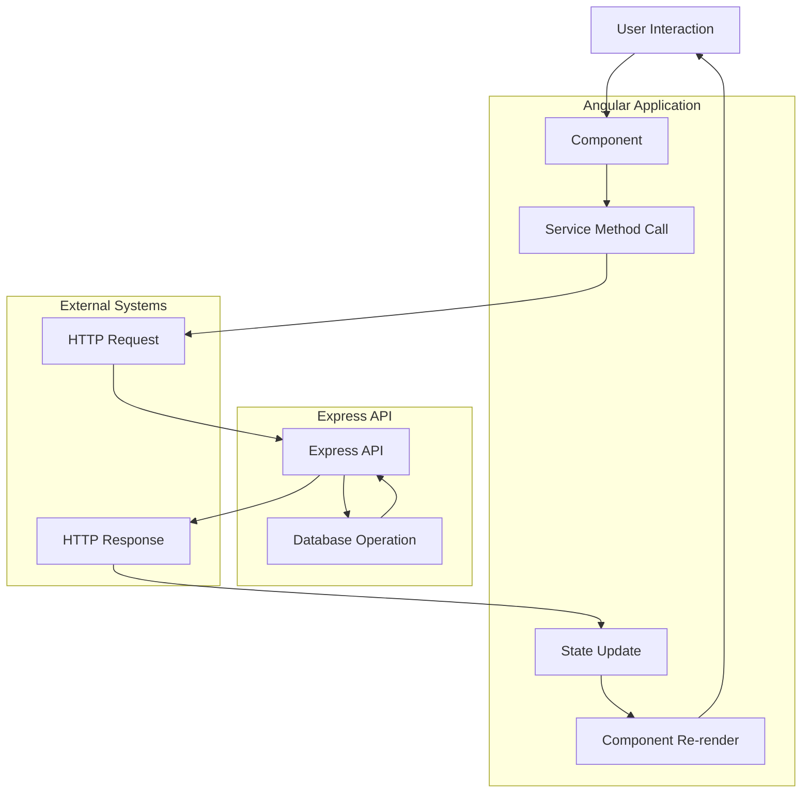

# Angular Component Structure and Data Flow

## 1. Component Hierarchy

```
AppComponent
├── HeaderComponent
├── SidebarComponent
├── MainContentComponent
│   ├── AuthModule
│   │   ├── LoginComponent
│   │   ├── RegisterComponent
│   │   ├── ForgotPasswordComponent
│   │   └── ResetPasswordComponent
│   ├── UserModule
│   │   ├── UserListComponent
│   │   ├── UserDetailComponent
│   │   ├── UserFormComponent
│   │   └── UserProfileComponent
│   ├── RoleModule
│   │   ├── RoleListComponent
│   │   ├── RoleDetailComponent
│   │   └── RoleFormComponent
│   └── AuditModule
│       ├── AuditLogListComponent
│       ├── AuditLogDetailComponent
│       └── AuditStatisticsComponent
└── FooterComponent
```

## 2. Module Structure

### AppModule (Root Module)
```typescript
@NgModule({
  declarations: [
    AppComponent,
    HeaderComponent,
    SidebarComponent,
    FooterComponent,
    MainContentComponent
  ],
  imports: [
    BrowserModule,
    BrowserAnimationsModule,
    HttpClientModule,
    AppRoutingModule,
    AuthModule,
    UserModule,
    RoleModule,
    AuditModule
  ],
  providers: [
    { provide: HTTP_INTERCEPTORS, useClass: AuthInterceptor, multi: true },
    { provide: HTTP_INTERCEPTORS, useClass: ErrorInterceptor, multi: true }
  ],
  bootstrap: [AppComponent]
})
export class AppModule { }
```

### AuthModule
```typescript
@NgModule({
  declarations: [
    LoginComponent,
    RegisterComponent,
    ForgotPasswordComponent,
    ResetPasswordComponent
  ],
  imports: [
    CommonModule,
    ReactiveFormsModule,
    AuthRoutingModule
  ]
})
export class AuthModule { }
```

### UserModule
```typescript
@NgModule({
  declarations: [
    UserListComponent,
    UserDetailComponent,
    UserFormComponent,
    UserProfileComponent
  ],
  imports: [
    CommonModule,
    ReactiveFormsModule,
    UserRoutingModule
  ]
})
export class UserModule { }
```

### RoleModule
```typescript
@NgModule({
  declarations: [
    RoleListComponent,
    RoleDetailComponent,
    RoleFormComponent
  ],
  imports: [
    CommonModule,
    ReactiveFormsModule,
    RoleRoutingModule
  ]
})
export class RoleModule { }
```

### AuditModule
```typescript
@NgModule({
  declarations: [
    AuditLogListComponent,
    AuditLogDetailComponent,
    AuditStatisticsComponent
  ],
  imports: [
    CommonModule,
    AuditRoutingModule
  ]
})
export class AuditModule { }
```

## 3. Component Details

### HeaderComponent
```typescript
@Component({
  selector: 'app-header',
  template: `
    <header class="header">
      <div class="logo">
        <h1>User Management System</h1>
      </div>
      <div class="user-menu" *ngIf="isAuthenticated$ | async">
        <div class="user-info">
          <span>{{ (user$ | async)?.firstName }} {{ (user$ | async)?.lastName }}</span>
          <span class="role">{{ (user$ | async)?.role?.name }}</span>
        </div>
        <button (click)="logout()">Logout</button>
      </div>
    </header>
  `
})
export class HeaderComponent implements OnInit {
  isAuthenticated$ = this.authService.isAuthenticated$;
  user$ = this.authService.user$;
  
  constructor(
    private authService: AuthService,
    private router: Router
  ) {}
  
  ngOnInit(): void {}
  
  logout(): void {
    this.authService.logout().subscribe({
      next: () => {
        this.router.navigate(['/login']);
      },
      error: (error) => {
        console.error('Logout error:', error);
        this.router.navigate(['/login']);
      }
    });
  }
}
```

### SidebarComponent
```typescript
@Component({
  selector: 'app-sidebar',
  template: `
    <nav class="sidebar" *ngIf="isAuthenticated$ | async">
      <ul>
        <li>
          <a routerLink="/dashboard" routerLinkActive="active">
            <i class="icon-dashboard"></i>
            Dashboard
          </a>
        </li>
        <li *ngIf="hasPermission('user:read')">
          <a routerLink="/users" routerLinkActive="active">
            <i class="icon-users"></i>
            Users
          </a>
        </li>
        <li *ngIf="hasPermission('role:read')">
          <a routerLink="/roles" routerLinkActive="active">
            <i class="icon-roles"></i>
            Roles
          </a>
        </li>
        <li *ngIf="hasPermission('audit:read')">
          <a routerLink="/audit" routerLinkActive="active">
            <i class="icon-audit"></i>
            Audit Logs
          </a>
        </li>
        <li>
          <a routerLink="/profile" routerLinkActive="active">
            <i class="icon-profile"></i>
            My Profile
          </a>
        </li>
      </ul>
    </nav>
  `
})
export class SidebarComponent implements OnInit {
  isAuthenticated$ = this.authService.isAuthenticated$;
  
  constructor(
    private authService: AuthService,
    private rbacService: RbacService
  ) {}
  
  ngOnInit(): void {}
  
  hasPermission(permission: string): boolean {
    const user = this.authService.getUser();
    return this.rbacService.hasPermission(user, permission);
  }
}
```

### UserListComponent
```typescript
@Component({
  selector: 'app-user-list',
  template: `
    <div class="user-list">
      <div class="header">
        <h2>Users</h2>
        <button *ngIf="hasPermission('user:create')" (click)="createUser()">
          Add User
        </button>
      </div>
      
      <div class="filters">
        <input 
          [(ngModel)]="searchTerm" 
          placeholder="Search users..." 
          (input)="onSearch()">
        <select [(ngModel)]="roleFilter" (change)="onRoleFilter()">
          <option value="">All Roles</option>
          <option *ngFor="let role of roles$ | async" [value]="role._id">
            {{ role.name }}
          </option>
        </select>
      </div>
      
      <div class="loading" *ngIf="loading$ | async">
        Loading users...
      </div>
      
      <div class="error" *ngIf="error$ | async as error">
        {{ error }}
      </div>
      
      <table class="users-table" *ngIf="!(loading$ | async)">
        <thead>
          <tr>
            <th>Name</th>
            <th>Email</th>
            <th>Role</th>
            <th>Status</th>
            <th>Last Login</th>
            <th>Actions</th>
          </tr>
        </thead>
        <tbody>
          <tr *ngFor="let user of users$ | async">
            <td>{{ user.firstName }} {{ user.lastName }}</td>
            <td>{{ user.email }}</td>
            <td>{{ user.role?.name }}</td>
            <td>
              <span [class.active]="user.isActive" [class.inactive]="!user.isActive">
                {{ user.isActive ? 'Active' : 'Inactive' }}
              </span>
            </td>
            <td>{{ user.lastLogin | date:'short' }}</td>
            <td>
              <button 
                *ngIf="hasPermission('user:read')" 
                (click)="viewUser(user._id)">
                View
              </button>
              <button 
                *ngIf="hasPermission('user:update')" 
                (click)="editUser(user._id)">
                Edit
              </button>
              <button 
                *ngIf="hasPermission('user:delete')" 
                (click)="deleteUser(user._id)"
                class="danger">
                Delete
              </button>
            </td>
          </tr>
        </tbody>
      </table>
      
      <div class="pagination" *ngIf="pagination$ | async as pagination">
        <button 
          (click)="previousPage()" 
          [disabled]="pagination.currentPage <= 1">
          Previous
        </button>
        <span>
          Page {{ pagination.currentPage }} of {{ pagination.totalPages }}
        </span>
        <button 
          (click)="nextPage()" 
          [disabled]="pagination.currentPage >= pagination.totalPages">
          Next
        </button>
      </div>
    </div>
  `
})
export class UserListComponent implements OnInit, OnDestroy {
  users$ = this.userService.users$;
  loading$ = this.userService.loading$;
  error$ = this.userService.error$;
  pagination$ = this.userService.pagination$;
  roles$ = this.roleService.roles$;
  
  searchTerm = '';
  roleFilter = '';
  private searchSubject = new Subject<string>();
  private destroy$ = new Subject<void>();
  
  constructor(
    private userService: UserService,
    private roleService: RoleService,
    private router: Router,
    private rbacService: RbacService,
    private authService: AuthService
  ) {}
  
  ngOnInit(): void {
    // Load initial data
    this.userService.loadUsers();
    this.roleService.loadRoles();
    
    // Setup search with debounce
    this.searchSubject
      .pipe(
        debounceTime(300),
        distinctUntilChanged(),
        takeUntil(this.destroy$)
      )
      .subscribe(searchTerm => {
        this.userService.updateFilters({ search: searchTerm });
      });
  }
  
  ngOnDestroy(): void {
    this.destroy$.next();
    this.destroy$.complete();
  }
  
  onSearch(): void {
    this.searchSubject.next(this.searchTerm);
  }
  
  onRoleFilter(): void {
    this.userService.updateFilters({ role: this.roleFilter || null });
  }
  
  viewUser(id: string): void {
    this.router.navigate(['/users', id]);
  }
  
  editUser(id: string): void {
    this.router.navigate(['/users', id, 'edit']);
  }
  
  createUser(): void {
    this.router.navigate(['/users', 'create']);
  }
  
  deleteUser(id: string): void {
    if (confirm('Are you sure you want to delete this user?')) {
      this.userService.deleteUser(id).subscribe({
        next: () => {
          // Reload the list
          this.userService.loadUsers();
        },
        error: (error) => {
          console.error('Error deleting user:', error);
        }
      });
    }
  }
  
  previousPage(): void {
    const pagination = this.userService.getPagination();
    if (pagination.currentPage > 1) {
      this.userService.updatePagination(pagination.currentPage - 1);
    }
  }
  
  nextPage(): void {
    const pagination = this.userService.getPagination();
    if (pagination.currentPage < pagination.totalPages) {
      this.userService.updatePagination(pagination.currentPage + 1);
    }
  }
  
  hasPermission(permission: string): boolean {
    const user = this.authService.getUser();
    return this.rbacService.hasPermission(user, permission);
  }
}
```

### UserFormComponent
```typescript
@Component({
  selector: 'app-user-form',
  template: `
    <div class="user-form">
      <h2>{{ isEditMode ? 'Edit User' : 'Create User' }}</h2>
      
      <form [formGroup]="userForm" (ngSubmit)="onSubmit()">
        <div class="form-group">
          <label for="firstName">First Name</label>
          <input 
            id="firstName" 
            formControlName="firstName" 
            type="text"
            [class.error]="isFieldInvalid('firstName')">
          <div class="error-message" *ngIf="isFieldInvalid('firstName')">
            {{ getErrorMessage('firstName') }}
          </div>
        </div>
        
        <div class="form-group">
          <label for="lastName">Last Name</label>
          <input 
            id="lastName" 
            formControlName="lastName" 
            type="text"
            [class.error]="isFieldInvalid('lastName')">
          <div class="error-message" *ngIf="isFieldInvalid('lastName')">
            {{ getErrorMessage('lastName') }}
          </div>
        </div>
        
        <div class="form-group">
          <label for="email">Email</label>
          <input 
            id="email" 
            formControlName="email" 
            type="email"
            [class.error]="isFieldInvalid('email')">
          <div class="error-message" *ngIf="isFieldInvalid('email')">
            {{ getErrorMessage('email') }}
          </div>
        </div>
        
        <div class="form-group" *ngIf="!isEditMode">
          <label for="password">Password</label>
          <input 
            id="password" 
            formControlName="password" 
            type="password"
            [class.error]="isFieldInvalid('password')">
          <div class="error-message" *ngIf="isFieldInvalid('password')">
            {{ getErrorMessage('password') }}
          </div>
        </div>
        
        <div class="form-group">
          <label for="roleId">Role</label>
          <select 
            id="roleId" 
            formControlName="roleId"
            [class.error]="isFieldInvalid('roleId')">
            <option value="">Select a role</option>
            <option *ngFor="let role of roles$ | async" [value]="role._id">
              {{ role.name }}
            </option>
          </select>
          <div class="error-message" *ngIf="isFieldInvalid('roleId')">
            {{ getErrorMessage('roleId') }}
          </div>
        </div>
        
        <div class="form-group">
          <label for="isActive">Status</label>
          <select 
            id="isActive" 
            formControlName="isActive">
            <option [value]="true">Active</option>
            <option [value]="false">Inactive</option>
          </select>
        </div>
        
        <div class="form-group">
          <label for="gender">Gender</label>
          <select 
            id="gender" 
            formControlName="gender">
            <option value="">Not specified</option>
            <option value="male">Male</option>
            <option value="female">Female</option>
            <option value="other">Other</option>
          </select>
        </div>
        
        <div class="form-group">
          <label for="phone">Phone</label>
          <input 
            id="phone" 
            formControlName="phone" 
            type="tel">
        </div>
        
        <div class="form-group">
          <label for="dateOfBirth">Date of Birth</label>
          <input 
            id="dateOfBirth" 
            formControlName="dateOfBirth" 
            type="date">
        </div>
        
        <div class="form-group">
          <label for="address">Address</label>
          <textarea 
            id="address" 
            formControlName="address" 
            rows="3">
          </textarea>
        </div>
        
        <div class="form-actions">
          <button type="button" (click)="cancel()" class="secondary">
            Cancel
          </button>
          <button 
            type="submit" 
            [disabled]="userForm.invalid || (loading$ | async)"
            class="primary">
            {{ isEditMode ? 'Update' : 'Create' }}
          </button>
        </div>
      </form>
      
      <div class="loading" *ngIf="loading$ | async">
        Saving user...
      </div>
      
      <div class="error" *ngIf="error$ | async as error">
        {{ error }}
      </div>
    </div>
  `
})
export class UserFormComponent implements OnInit {
  @Input() user: User | null = null;
  @Output() save = new EventEmitter<User>();
  @Output() cancel = new EventEmitter<void>();
  
  userForm: FormGroup;
  loading$ = this.userService.loading$;
  error$ = this.userService.error$;
  roles$ = this.roleService.roles$;
  
  get isEditMode(): boolean {
    return !!this.user;
  }
  
  constructor(
    private fb: FormBuilder,
    private userService: UserService,
    private roleService: RoleService
  ) {
    this.userForm = this.fb.group({
      firstName: ['', [Validators.required, Validators.maxLength(50)]],
      lastName: ['', [Validators.required, Validators.maxLength(50)]],
      email: ['', [Validators.required, Validators.email]],
      password: ['', this.isEditMode ? [] : [Validators.required, Validators.minLength(6)]],
      roleId: ['', Validators.required],
      isActive: [true],
      gender: [''],
      phone: [''],
      dateOfBirth: [''],
      address: ['']
    });
  }
  
  ngOnInit(): void {
    this.roleService.loadRoles();
    
    if (this.user) {
      this.userForm.patchValue({
        firstName: this.user.firstName,
        lastName: this.user.lastName,
        email: this.user.email,
        roleId: this.user.role?._id,
        isActive: this.user.isActive,
        gender: this.user.gender || '',
        phone: this.user.phone || '',
        dateOfBirth: this.user.dateOfBirth ? 
          new Date(this.user.dateOfBirth).toISOString().split('T')[0] : '',
        address: this.user.address || ''
      });
    }
  }
  
  onSubmit(): void {
    if (this.userForm.valid) {
      const formData = this.userForm.value;
      
      if (this.isEditMode && this.user) {
        this.userService.updateUser(this.user._id, formData).subscribe({
          next: (updatedUser) => {
            this.save.emit(updatedUser);
          },
          error: (error) => {
            console.error('Error updating user:', error);
          }
        });
      } else {
        this.userService.createUser(formData).subscribe({
          next: (newUser) => {
            this.save.emit(newUser);
          },
          error: (error) => {
            console.error('Error creating user:', error);
          }
        });
      }
    }
  }
  
  isFieldInvalid(fieldName: string): boolean {
    const field = this.userForm.get(fieldName);
    return !!(field && field.invalid && field.touched);
  }
  
  getErrorMessage(fieldName: string): string {
    const field = this.userForm.get(fieldName);
    if (field && field.errors) {
      if (field.errors['required']) {
        return `${this.getFieldLabel(fieldName)} is required`;
      }
      if (field.errors['email']) {
        return 'Please enter a valid email';
      }
      if (field.errors['minlength']) {
        return `${this.getFieldLabel(fieldName)} must be at least ${field.errors['minlength'].requiredLength} characters`;
      }
      if (field.errors['maxlength']) {
        return `${this.getFieldLabel(fieldName)} cannot exceed ${field.errors['maxlength'].requiredLength} characters`;
      }
    }
    return '';
  }
  
  private getFieldLabel(fieldName: string): string {
    const labels: Record<string, string> = {
      firstName: 'First name',
      lastName: 'Last name',
      email: 'Email',
      password: 'Password',
      roleId: 'Role'
    };
    return labels[fieldName] || fieldName;
  }
}
```

## 4. Data Flow Diagram



## 5. Component Communication Patterns

### 1. Parent to Child Communication
```typescript
// Parent component
<app-user-form 
  [user]="selectedUser" 
  (save)="onUserSaved($event)"
  (cancel)="onFormCancel()">
</app-user-form>
```

### 2. Child to Parent Communication
```typescript
// Child component
@Output() save = new EventEmitter<User>();

onSubmit(): void {
  if (this.userForm.valid) {
    this.save.emit(this.userForm.value);
  }
}
```

### 3. Service-Based Communication
```typescript
// Shared service for cross-component communication
@Injectable({
  providedIn: 'root'
})
export class UserEventService {
  private userCreatedSubject = new Subject<User>();
  public userCreated$ = this.userCreatedSubject.asObservable();
  
  userCreated(user: User): void {
    this.userCreatedSubject.next(user);
  }
}
```

### 4. Router-Based Communication
```typescript
// Navigate with data
this.router.navigate(['/users', userId], {
  state: { mode: 'edit' }
});

// Access route data in target component
ngOnInit(): void {
  const navigation = this.router.getCurrentNavigation();
  const state = navigation?.extras?.state as { mode: string };
  if (state?.mode === 'edit') {
    // Handle edit mode
  }
}
```

## 6. Reactive Forms Implementation

### Form Validation
```typescript
// Custom validator for password strength
export function passwordStrengthValidator(): ValidatorFn {
  return (control: AbstractControl): ValidationErrors | null => {
    const value = control.value;
    if (!value) {
      return null;
    }
    
    const hasUpperCase = /[A-Z]/.test(value);
    const hasLowerCase = /[a-z]/.test(value);
    const hasNumeric = /[0-9]/.test(value);
    const hasSpecial = /[!@#$%^&*(),.?":{}|<>]/.test(value);
    
    const valid = hasUpperCase && hasLowerCase && hasNumeric && hasSpecial;
    
    return valid ? null : { passwordStrength: true };
  };
}

// Usage in form
this.userForm = this.fb.group({
  password: ['', [
    Validators.required, 
    Validators.minLength(8),
    passwordStrengthValidator()
  ]]
});
```

## 7. Error Handling in Components

### Global Error Handling
```typescript
// Error interceptor
@Injectable()
export class ErrorInterceptor implements HttpInterceptor {
  constructor(
    private snackBar: MatSnackBar,
    private router: Router
  ) {}
  
  intercept(req: HttpRequest<any>, next: HttpHandler): Observable<HttpEvent<any>> {
    return next.handle(req).pipe(
      catchError((error: HttpErrorResponse) => {
        let errorMessage = 'An error occurred';
        
        if (error.error?.message) {
          errorMessage = error.error.message;
        } else if (error.status === 0) {
          errorMessage = 'Network error. Please check your connection.';
        } else if (error.status === 401) {
          errorMessage = 'Your session has expired. Please log in again.';
          this.router.navigate(['/login']);
        } else if (error.status === 403) {
          errorMessage = 'You do not have permission to perform this action.';
        } else if (error.status === 404) {
          errorMessage = 'The requested resource was not found.';
        } else if (error.status === 500) {
          errorMessage = 'A server error occurred. Please try again later.';
        }
        
        this.snackBar.open(errorMessage, 'Close', {
          duration: 5000,
          panelClass: ['error-snackbar']
        });
        
        return throwError(() => error);
      })
    );
  }
}
```

This component structure provides a comprehensive foundation for the Angular application, with clear separation of concerns, proper data flow, and robust error handling.