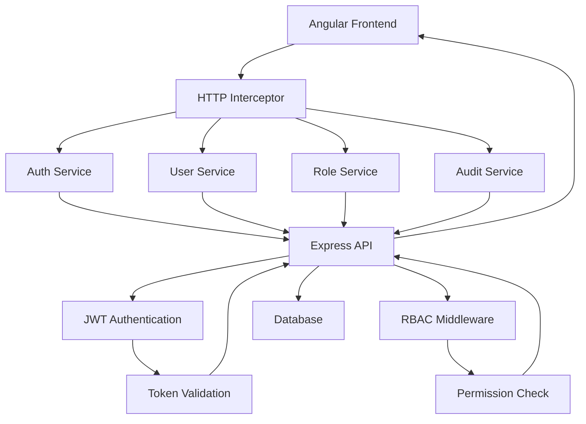

# Angular 20 + Express API Integration Summary

## Overview

This document provides a complete guide for integrating an Angular 20 frontend with the Express User Management API. The integration follows modern best practices for authentication, state management, component architecture, and deployment.

## 1. API Integration Architecture

### Key Components
1. **Authentication Service** - Handles JWT-based authentication
2. **User Service** - Manages user data operations
3. **Role Service** - Handles role and permission management
4. **HTTP Interceptors** - Manage authentication headers and error handling
5. **Route Guards** - Protect routes based on authentication and permissions

### Data Flow


## 2. Authentication Flow

### Login Process
1. User submits credentials via login form
2. AuthService sends POST request to `/api/auth/login`
3. API validates credentials and returns JWT tokens
4. Tokens are stored in localStorage/sessionStorage
5. User is redirected to dashboard

### Token Management
- Access tokens expire in 1 hour
- Refresh tokens expire in 7 days
- AuthInterceptor automatically adds Authorization header
- 401 responses trigger token refresh

### Logout Process
1. AuthService sends POST request to `/api/auth/logout`
2. Refresh token is invalidated on server
3. All tokens are cleared from client storage
4. User is redirected to login page

## 3. Role-Based Access Control (RBAC)

### Permission Structure
- `resource:action` format (e.g., `user:create`)
- Wildcard permissions (e.g., `user:*`)
- Self permissions (e.g., `user:update:self`)
- Super admin with `*:*` permission

### Implementation
- RbacService checks user permissions
- RoleGuard protects routes based on permissions
- Component-level permission checks for UI elements

## 4. State Management

### Service-Based Approach
- BehaviorSubject for state management
- Selectors for derived data
- Actions for state mutations
- Error and loading states

### Key State Models
```typescript
interface AuthState {
  isAuthenticated: boolean;
  user: User | null;
  accessToken: string | null;
  refreshToken: string | null;
  loading: boolean;
  error: string | null;
}

interface UserState {
  users: User[];
  selectedUser: User | null;
  loading: boolean;
  error: string | null;
  pagination: Pagination;
  filters: UserFilters;
}
```

## 5. Component Architecture

### Module Structure
```
src/
├── app/
│   ├── core/                 # Core services, guards, interceptors
│   ├── shared/               # Shared components, pipes, directives
│   ├── features/             # Feature modules
│   │   ├── auth/
│   │   ├── users/
│   │   ├── roles/
│   │   └── audit/
│   ├── layouts/              # Layout components
│   └── app-routing.module.ts
```

### Key Components
- **HeaderComponent** - Navigation and user menu
- **SidebarComponent** - Feature navigation with RBAC
- **UserListComponent** - User management with pagination
- **UserFormComponent** - Create/edit user forms
- **RoleListComponent** - Role management
- **AuditLogListComponent** - Audit trail viewing

## 6. API Endpoints Integration

### Authentication Endpoints
- `POST /api/auth/login` - User authentication
- `POST /api/auth/register` - User registration
- `POST /api/auth/refresh` - Token refresh
- `POST /api/auth/logout` - User logout
- `POST /api/auth/forgot-password` - Password reset request
- `POST /api/auth/reset-password` - Password reset
- `GET /api/auth/profile` - Current user profile

### User Management Endpoints
- `GET /api/users` - List users with pagination
- `GET /api/users/:id` - Get user details
- `POST /api/users` - Create new user
- `PUT /api/users/:id` - Update user
- `DELETE /api/users/:id` - Delete user
- `PUT /api/users/profile` - Update own profile

### Role Management Endpoints
- `GET /api/roles` - List roles
- `GET /api/roles/:id` - Get role details
- `POST /api/roles` - Create new role
- `PUT /api/roles/:id` - Update role
- `DELETE /api/roles/:id` - Delete role
- `GET /api/roles/permissions` - Available permissions

## 7. Deployment Configuration

### Environment Files
```typescript
// Development
export const environment = {
  production: false,
  apiUrl: 'http://localhost:3000/api'
};

// Production
export const environment = {
  production: true,
  apiUrl: 'https://your-production-api.com/api'
};
```

### Docker Deployment
- Multi-stage Docker build for Angular app
- Nginx configuration for production serving
- Docker Compose for full stack deployment

### CORS Configuration
```javascript
app.use(cors({
  origin: process.env.NODE_ENV === 'production' 
    ? ['https://yourdomain.com'] 
    : ['http://localhost:4200'],
  credentials: true
}));
```

## 8. Testing Strategy

### Unit Testing
- Service testing with HttpClientTestingModule
- Component testing with ReactiveFormsModule
- Guard and interceptor testing

### Integration Testing
- API integration testing with mocked HTTP calls
- State management testing

### End-to-End Testing
- Cypress for comprehensive E2E testing
- Authentication flows
- User management workflows

## 9. Security Considerations

### Token Storage
- Access tokens in sessionStorage for SPA
- Refresh tokens in localStorage
- HttpOnly cookies for enhanced security

### Input Validation
- Client-side validation with Angular Reactive Forms
- Server-side validation (handled by API)
- Sanitization of user inputs

### Error Handling
- Global error interceptor
- User-friendly error messages
- Security-sensitive error filtering

## 10. Performance Optimization

### Lazy Loading
```typescript
{
  path: 'users',
  loadChildren: () => import('./features/users/users.module').then(m => m.UsersModule)
}
```

### OnPush Change Detection
```typescript
@Component({
  changeDetection: ChangeDetectionStrategy.OnPush
})
```

### TrackBy Functions
```typescript
trackByUserId(index: number, user: User): string {
  return user._id;
}
```

## 11. Implementation Checklist

### Phase 1: Core Setup
- [x] Environment configuration
- [x] HTTP interceptors implementation
- [x] Authentication service
- [x] Route guards
- [x] RBAC service

### Phase 2: Feature Development
- [x] User management components
- [x] Role management components
- [x] Audit log components
- [x] Profile management

### Phase 3: Testing & Deployment
- [x] Unit tests for services and components
- [x] Integration tests
- [x] E2E tests with Cypress
- [x] Production deployment configuration

## 12. Key Code Examples

### Authentication Service
```typescript
login(credentials: LoginCredentials): Observable<AuthResponse> {
  return this.http.post<AuthResponse>(`${environment.apiUrl}/auth/login`, credentials)
    .pipe(
      tap(response => this.setAuthState(response)),
      catchError(error => this.handleError(error))
    );
}
```

### HTTP Interceptor
```typescript
intercept(req: HttpRequest<any>, next: HttpHandler): Observable<HttpEvent<any>> {
  const accessToken = this.authService.getAccessToken();
  
  if (accessToken) {
    const authReq = req.clone({
      headers: req.headers.set('Authorization', `Bearer ${accessToken}`)
    });
    
    return next.handle(authReq);
  }
  
  return next.handle(req);
}
```

### Route Guard
```typescript
canActivate(route: ActivatedRouteSnapshot): boolean | UrlTree {
  const requiredPermission = route.data['permission'];
  const user = this.authService.getUser();
  
  if (user && this.rbacService.hasPermission(user, requiredPermission)) {
    return true;
  }
  
  return this.router.createUrlTree(['/unauthorized']);
}
```

This integration provides a robust, scalable foundation for an Angular 20 application connected to the Express User Management API, with proper authentication, authorization, state management, and testing strategies.