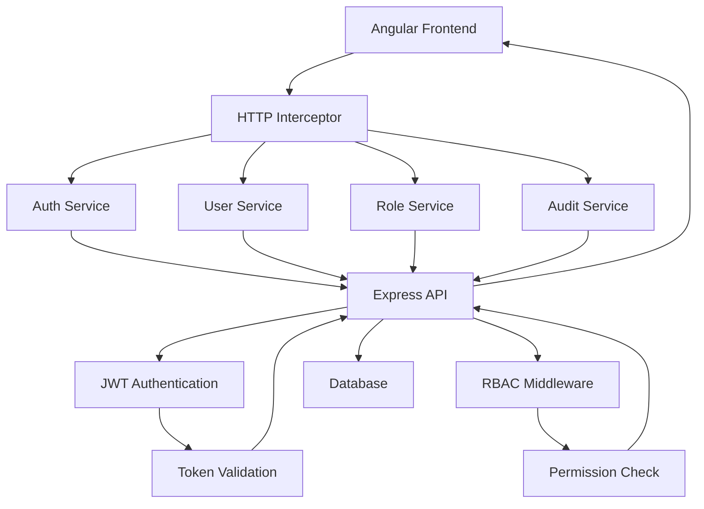

# Angular 20 Integration with Express User Management API

## 1. API Overview

The Express API provides a complete user management system with the following key features:
- Authentication (JWT-based)
- Role-based access control (RBAC)
- User management
- Role management
- Audit logging
- Password reset functionality

### Base URL
```
http://localhost:3000/api
```

### Key Endpoints

#### Authentication
- `POST /auth/register` - Register new user
- `POST /auth/login` - User login
- `POST /auth/refresh` - Refresh access token
- `POST /auth/logout` - User logout
- `POST /auth/forgot-password` - Request password reset
- `POST /auth/reset-password` - Reset password
- `POST /auth/change-password` - Change current password
- `GET /auth/profile` - Get current user profile

#### Users
- `GET /users` - Get all users (paginated)
- `GET /users/:id` - Get user by ID
- `POST /users` - Create new user
- `PUT /users/:id` - Update user
- `DELETE /users/:id` - Delete user
- `GET /users/profile` - Get current user profile
- `PUT /users/profile` - Update current user profile
- `PUT /users/change-password` - Change password

#### Roles
- `GET /roles` - Get all roles
- `GET /roles/:id` - Get role by ID
- `POST /roles` - Create new role
- `PUT /roles/:id` - Update role
- `DELETE /roles/:id` - Delete role
- `GET /roles/permissions` - Get available permissions

#### Audit Logs
- `GET /audit/logs` - Get all audit logs
- `GET /audit/logs/:id` - Get audit log by ID
- `GET /audit/logs/my` - Get current user's audit logs
- `GET /audit/users/:userId/logs` - Get audit logs for specific user
- `GET /audit/statistics` - Get audit statistics
- `GET /audit/actions` - Get available actions
- `GET /audit/resources` - Get available resources

## 2. Data Models

### User Model
```typescript
interface User {
  _id: string;
  firstName: string;
  lastName: string;
  email: string;
  role: Role;
  isActive: boolean;
  avatar?: string;
  gender?: 'male' | 'female' | 'other';
  phone?: string;
  dateOfBirth?: string;
  address?: string;
  lastLogin?: Date;
  createdAt: Date;
  updatedAt: Date;
}
```

### Role Model
```typescript
interface Role {
  _id: string;
  name: string;
  permissions: string[];
  description: string;
  createdAt: Date;
  updatedAt: Date;
}
```

### Audit Log Model
```typescript
interface AuditLog {
  _id: string;
  userId: string;
  action: string;
  resource: string;
  resourceId?: string;
  before?: any;
  after?: any;
  ipAddress: string;
  userAgent: string;
  timestamp: Date;
}
```

## 3. Authentication Flow

The API uses JWT tokens for authentication:
1. User logs in with email/password
2. API returns access token (1 hour expiry) and refresh token (7 days expiry)
3. Access token is used for all authenticated requests in Authorization header
4. When access token expires, use refresh token to get a new one
5. Logout invalidates the refresh token

## 4. Angular Integration Architecture

### Project Structure
```
src/
├── app/
│   ├── core/                 # Core module (services, guards, interceptors)
│   │   ├── services/
│   │   ├── guards/
│   │   └── interceptors/
│   ├── shared/               # Shared module (components, pipes, directives)
│   │   ├── components/
│   │   ├── pipes/
│   │   └── directives/
│   ├── features/             # Feature modules
│   │   ├── auth/
│   │   ├── users/
│   │   ├── roles/
│   │   └── audit/
│   ├── layouts/              # Layout components
│   └── app-routing.module.ts
├── assets/
└── environments/
```

### Key Angular Services

#### AuthService
Handles authentication operations:
- Login/Logout
- Token management
- User profile retrieval
- Password reset functionality

#### UserService
Handles user management operations:
- CRUD operations for users
- Profile management
- Password changes

#### RoleService
Handles role management operations:
- CRUD operations for roles
- Permission management

#### AuditService
Handles audit log operations:
- Retrieving audit logs
- Audit statistics

### HTTP Interceptors

#### AuthInterceptor
- Automatically adds Authorization header with JWT token to requests
- Handles 401 responses by attempting token refresh
- Redirects to login on authentication failure

#### ErrorInterceptor
- Handles HTTP errors globally
- Shows user-friendly error messages
- Handles specific error cases (validation errors, etc.)

### Route Guards

#### AuthGuard
- Protects routes that require authentication
- Redirects unauthenticated users to login

#### RoleGuard
- Protects routes based on user permissions
- Checks if user has required permissions to access route

## 5. State Management

For state management, we'll use Angular's built-in services with RxJS BehaviorSubject for simple state management. For more complex applications, NgRx can be introduced later.

### Authentication State
```typescript
interface AuthState {
  isAuthenticated: boolean;
  user: User | null;
  accessToken: string | null;
  refreshToken: string | null;
}
```

### User Management State
```typescript
interface UserState {
  users: User[];
  currentUser: User | null;
  loading: boolean;
  error: string | null;
}
```

## 6. Component Structure

### Authentication Components
- LoginComponent
- RegisterComponent
- ForgotPasswordComponent
- ResetPasswordComponent

### User Management Components
- UserListComponent
- UserDetailComponent
- UserProfileComponent
- UserFormComponent

### Role Management Components
- RoleListComponent
- RoleDetailComponent
- RoleFormComponent

### Audit Components
- AuditLogListComponent
- AuditLogDetailComponent
- AuditStatisticsComponent

## 7. Implementation Steps

### Step 1: Environment Configuration
Create environment files for different environments:
```typescript
// environments/environment.ts
export const environment = {
  production: false,
  apiUrl: 'http://localhost:3001/api'
};

// environments/environment.prod.ts
export const environment = {
  production: true,
  apiUrl: 'https://your-production-api.com/api'
};
```

### Step 2: Authentication Service Implementation
```typescript
// core/services/auth.service.ts
@Injectable({
  providedIn: 'root'
})
export class AuthService {
  private authState = new BehaviorSubject<AuthState>({
    isAuthenticated: false,
    user: null,
    accessToken: null,
    refreshToken: null
  });
  
  // Login method
  login(email: string, password: string): Observable<AuthResponse> {
    return this.http.post<AuthResponse>(`${this.apiUrl}/auth/login`, { email, password })
      .pipe(
        tap(response => {
          // Store tokens and user data
          this.setAuthState(response);
        })
      );
  }
  
  // Other methods...
}
```

### Step 3: HTTP Interceptors
```typescript
// core/interceptors/auth.interceptor.ts
@Injectable()
export class AuthInterceptor implements HttpInterceptor {
  constructor(private authService: AuthService) {}
  
  intercept(req: HttpRequest<any>, next: HttpHandler): Observable<HttpEvent<any>> {
    const authState = this.authService.getAuthState();
    
    if (authState.accessToken) {
      const authReq = req.clone({
        headers: req.headers.set('Authorization', `Bearer ${authState.accessToken}`)
      });
      return next.handle(authReq);
    }
    
    return next.handle(req);
  }
}
```

### Step 4: Route Guards
```typescript
// core/guards/auth.guard.ts
@Injectable({
  providedIn: 'root'
})
export class AuthGuard implements CanActivate {
  constructor(
    private authService: AuthService,
    private router: Router
  ) {}
  
  canActivate(): boolean {
    if (this.authService.isAuthenticated()) {
      return true;
    }
    
    this.router.navigate(['/login']);
    return false;
  }
}
```

## 8. Error Handling

Implement comprehensive error handling:
- Global error interceptor
- User-friendly error messages
- Validation error display
- Network error handling

## 9. Testing Strategy

### Unit Testing
- Test services with mocked HTTP calls
- Test components with mocked services
- Test guards and interceptors

### Integration Testing
- Test API integration with real endpoints
- Test authentication flows
- Test role-based access control

## 10. Deployment Considerations

### CORS Configuration
Ensure the Express API is configured to accept requests from the Angular frontend origin.

### Environment Variables
Set appropriate environment variables for different deployment environments.

### Security
- Use HTTPS in production
- Implement proper token storage (HttpOnly cookies or secure storage)
- Sanitize user inputs
- Implement rate limiting

## 11. Sample Implementation Code

### User Service
```typescript
@Injectable({
  providedIn: 'root'
})
export class UserService {
  private apiUrl = environment.apiUrl;
  
  constructor(private http: HttpClient) {}
  
  getUsers(page: number = 1, limit: number = 10): Observable<PaginatedResponse<User>> {
    const params = new HttpParams()
      .set('page', page.toString())
      .set('limit', limit.toString());
      
    return this.http.get<PaginatedResponse<User>>(`${this.apiUrl}/users`, { params });
  }
  
  getUserById(id: string): Observable<User> {
    return this.http.get<User>(`${this.apiUrl}/users/${id}`);
  }
  
  createUser(userData: CreateUserDto): Observable<User> {
    return this.http.post<User>(`${this.apiUrl}/users`, userData);
  }
  
  updateUser(id: string, userData: UpdateUserDto): Observable<User> {
    return this.http.put<User>(`${this.apiUrl}/users/${id}`, userData);
  }
  
  deleteUser(id: string): Observable<void> {
    return this.http.delete<void>(`${this.apiUrl}/users/${id}`);
  }
}
```

### User List Component
```typescript
@Component({
  selector: 'app-user-list',
  template: `
    <div class="user-list">
      <h2>Users</h2>
      <div class="filters">
        <input [(ngModel)]="searchTerm" placeholder="Search users..." (input)="onSearch()">
      </div>
      <div class="users-table">
        <table>
          <thead>
            <tr>
              <th>Name</th>
              <th>Email</th>
              <th>Role</th>
              <th>Status</th>
              <th>Actions</th>
            </tr>
          </thead>
          <tbody>
            <tr *ngFor="let user of users">
              <td>{{ user.firstName }} {{ user.lastName }}</td>
              <td>{{ user.email }}</td>
              <td>{{ user.role?.name }}</td>
              <td>{{ user.isActive ? 'Active' : 'Inactive' }}</td>
              <td>
                <button (click)="viewUser(user._id)">View</button>
                <button (click)="editUser(user._id)">Edit</button>
                <button (click)="deleteUser(user._id)">Delete</button>
              </td>
            </tr>
          </tbody>
        </table>
      </div>
      <div class="pagination">
        <button (click)="previousPage()" [disabled]="currentPage <= 1">Previous</button>
        <span>Page {{ currentPage }} of {{ totalPages }}</span>
        <button (click)="nextPage()" [disabled]="currentPage >= totalPages">Next</button>
      </div>
    </div>
  `
})
export class UserListComponent implements OnInit {
  users: User[] = [];
  currentPage = 1;
  totalPages = 1;
  searchTerm = '';
  
  constructor(
    private userService: UserService,
    private router: Router
  ) {}
  
  ngOnInit(): void {
    this.loadUsers();
  }
  
  loadUsers(): void {
    this.userService.getUsers(this.currentPage, 10).subscribe({
      next: (response) => {
        this.users = response.data;
        this.totalPages = response.totalPages;
      },
      error: (error) => {
        console.error('Error loading users:', error);
      }
    });
  }
  
  onSearch(): void {
    // Implement search functionality
  }
  
  viewUser(id: string): void {
    this.router.navigate(['/users', id]);
  }
  
  editUser(id: string): void {
    this.router.navigate(['/users', id, 'edit']);
  }
  
  deleteUser(id: string): void {
    if (confirm('Are you sure you want to delete this user?')) {
      this.userService.deleteUser(id).subscribe({
        next: () => {
          this.loadUsers(); // Reload the list
        },
        error: (error) => {
          console.error('Error deleting user:', error);
        }
      });
    }
  }
  
  previousPage(): void {
    if (this.currentPage > 1) {
      this.currentPage--;
      this.loadUsers();
    }
  }
  
  nextPage(): void {
    if (this.currentPage < this.totalPages) {
      this.currentPage++;
      this.loadUsers();
    }
  }
}
```

## 12. API Integration Flow Diagram



This integration plan provides a comprehensive approach to connecting an Angular 20 frontend with the Express User Management API. The architecture is modular, scalable, and follows Angular best practices while properly handling authentication, authorization, and data management.