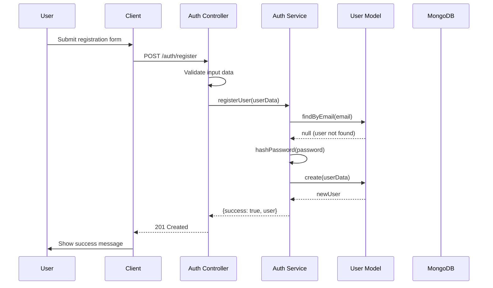
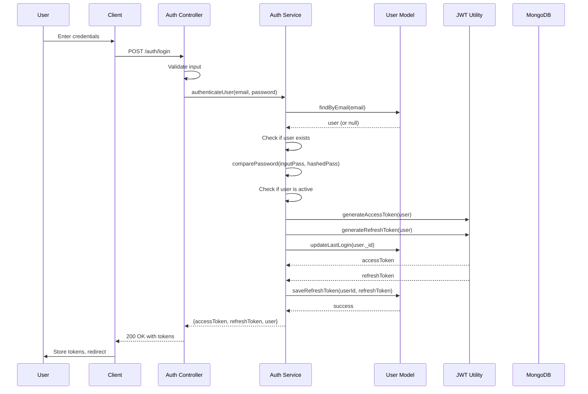
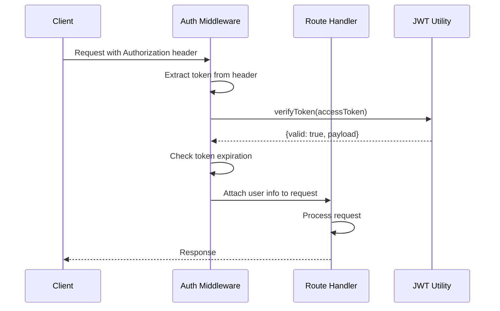
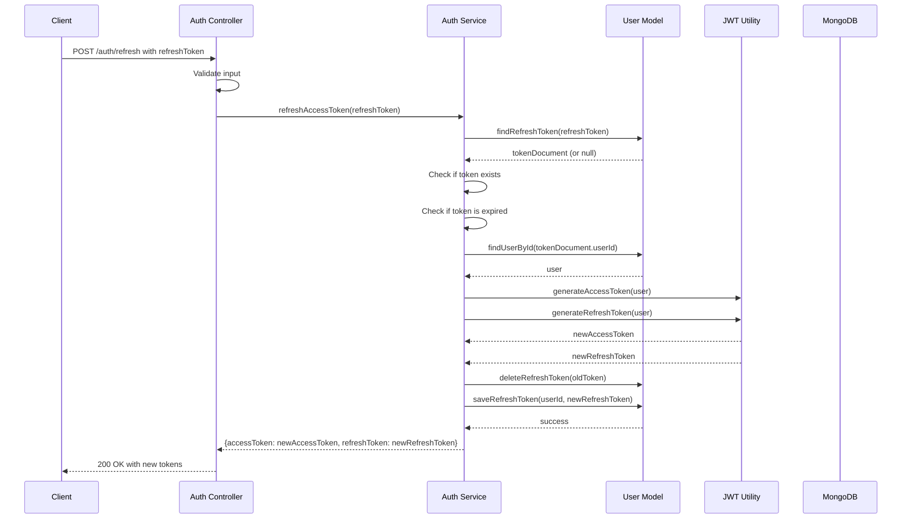
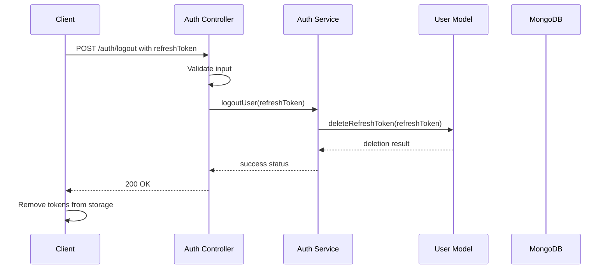

# Authentication Flow with JWT and Refresh Tokens

## Overview
This document describes the detailed authentication flow implementation using JWT (JSON Web Tokens) with refresh tokens for the user management system.

## JWT Token Structure

### Access Token
- **Purpose**: Used to authenticate API requests
- **Expiration**: Short-lived (e.g., 15 minutes)
- **Payload**:
  ```json
  {
    "userId": "user_id",
    "email": "user@example.com",
    "roleId": "role_id",
    "permissions": ["permission1", "permission2"],
    "iat": 1516239022,
    "exp": 1516240822
  }
  ```

### Refresh Token
- **Purpose**: Used to obtain new access tokens
- **Expiration**: Long-lived (e.g., 7 days)
- **Storage**: Database with user reference and expiration time
- **Payload**:
  ```json
  {
    "tokenId": "unique_token_id",
    "userId": "user_id",
    "iat": 1516239022,
    "exp": 1516843822
  }
  ```

## Authentication Flow Steps

### 1. User Registration



### 2. User Login



### 3. Access Token Usage



### 4. Refresh Token Usage



### 5. User Logout



## Token Management

### Token Storage
- **Access Token**: Stored in memory on client-side (not in localStorage/sessionStorage for security)
- **Refresh Token**: Stored in secure, httpOnly cookie or secure storage on client
- **Server-side**: Refresh tokens stored in database with expiration and user reference

### Token Revocation
- Refresh tokens are deleted from database on logout
- Refresh tokens are automatically deleted when they expire
- All refresh tokens for a user can be invalidated (e.g., on password change)

### Security Considerations
1. **HTTPS Only**: All authentication requests must be over HTTPS
2. **HttpOnly Cookies**: Refresh tokens should be stored in httpOnly cookies
3. **SameSite Cookies**: Prevent CSRF attacks
4. **Token Rotation**: New refresh token issued with each refresh
5. **Token Blacklisting**: Optional mechanism to invalidate compromised tokens

## Implementation Details

### JWT Utility Functions

```javascript
// Generate Access Token
function generateAccessToken(user) {
  return jwt.sign(
    {
      userId: user._id,
      email: user.email,
      roleId: user.role,
      // permissions would be fetched from role
    },
    process.env.JWT_ACCESS_SECRET,
    { expiresIn: process.env.JWT_ACCESS_EXPIRES_IN }
  );
}

// Generate Refresh Token
function generateRefreshToken(user) {
  return jwt.sign(
    {
      userId: user._id
    },
    process.env.JWT_REFRESH_SECRET,
    { expiresIn: process.env.JWT_REFRESH_EXPIRES_IN }
  );
}

// Verify Token
function verifyToken(token, secret) {
  try {
    return { valid: true, payload: jwt.verify(token, secret) };
  } catch (error) {
    return { valid: false, error: error.message };
  }
}
```

### Refresh Token Storage Model

```javascript
// refreshToken.model.js
{
  token: String,           // The actual refresh token
  userId: ObjectId,        // Reference to user
  expiresAt: Date,         // Expiration timestamp
  createdAt: Date          // Creation timestamp
}

// Indexes
// - token (unique)
// - userId
// - expiresAt (with TTL index for automatic cleanup)
```

### Middleware for Token Verification

```javascript
// auth.middleware.js
function authenticateToken(req, res, next) {
  const authHeader = req.headers['authorization'];
  const token = authHeader && authHeader.split(' ')[1]; // Bearer TOKEN
  
  if (!token) {
    return res.status(401).json({ message: 'Access token required' });
  }
  
  const result = verifyToken(token, process.env.JWT_ACCESS_SECRET);
  
  if (!result.valid) {
    return res.status(403).json({ message: 'Invalid or expired token' });
  }
  
  req.user = result.payload;
  next();
}
```

## Error Handling

### Common Authentication Errors
1. **Invalid Credentials** (401): Wrong email or password
2. **Token Expired** (403): Access token has expired
3. **Invalid Token** (403): Malformed or tampered token
4. **Missing Token** (401): No token provided in request
5. **Refresh Token Expired** (401): Refresh token has expired
6. **Refresh Token Invalid** (403): Refresh token not found or invalid

### Error Response Format
```json
{
  "success": false,
  "message": "Authentication failed",
  "error": {
    "code": "AUTH_ERROR",
    "details": "Invalid credentials"
  }
}