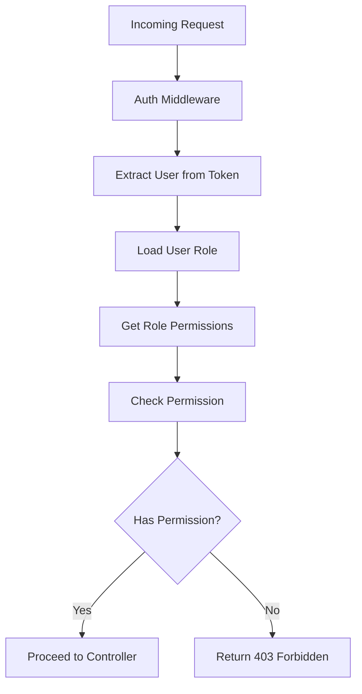

# Role-Based Access Control (RBAC) Implementation

## Overview
This document describes the role-based access control implementation for the user management system, defining how permissions are assigned to roles and enforced throughout the application.

## RBAC Model

### Core Concepts
1. **User**: An individual who interacts with the system
2. **Role**: A named collection of permissions (e.g., "admin", "user", "moderator")
3. **Permission**: A specific action on a resource (e.g., "user:create", "role:delete")
4. **Assignment**: The association of a user to a role

### Permission Structure
Permissions follow a consistent naming convention: `resource:action`
- **resource**: The entity being accessed (e.g., "user", "role", "audit")
- **action**: The operation being performed (e.g., "create", "read", "update", "delete")

Examples:
- `user:create` - Create users
- `user:read` - Read user information
- `user:update` - Update user information
- `user:delete` - Delete users
- `role:*` - All actions on roles
- `audit:read` - Read audit logs

## Role Definitions

### Default Roles

#### 1. Super Admin
```json
{
  "name": "super-admin",
  "permissions": ["*:*"],  // All permissions
  "description": "Full system access"
}
```

#### 2. Admin
```json
{
  "name": "admin",
  "permissions": [
    "user:*",
    "role:*",
    "audit:read"
  ],
  "description": "Can manage users and roles, view audit logs"
}
```

#### 3. Moderator
```json
{
  "name": "moderator",
  "permissions": [
    "user:read",
    "user:update",
    "audit:read"
  ],
  "description": "Can view and update users, view audit logs"
}
```

#### 4. User
```json
{
  "name": "user",
  "permissions": [
    "user:read:self",
    "user:update:self"
  ],
  "description": "Standard user with limited permissions"
}
```

## Permission Checking Flow



## Implementation Details

### Permission Checking Utility

```javascript
// rbac.util.js
class RBAC {
  /**
   * Check if user has a specific permission
   * @param {Object} user - User object with role populated
   * @param {string} requiredPermission - Permission to check
   * @returns {boolean} - True if user has permission
   */
  static hasPermission(user, requiredPermission) {
    // Super admin has all permissions
    if (user.role && user.role.permissions.includes('*:*')) {
      return true;
    }
    
    // Check for exact permission
    if (user.role && user.role.permissions.includes(requiredPermission)) {
      return true;
    }
    
    // Check for wildcard permissions (e.g., "user:*")
    const [resource, action] = requiredPermission.split(':');
    if (user.role && user.role.permissions.includes(`${resource}:*`)) {
      return true;
    }
    
    // Special case for self permissions
    if (requiredPermission.endsWith(':self')) {
      const basePermission = requiredPermission.replace(':self', '');
      return this.hasPermission(user, basePermission);
    }
    
    return false;
  }
  
  /**
   * Middleware to check permissions
   * @param {string} requiredPermission - Permission required for route
   * @returns {Function} - Express middleware function
   */
  static checkPermission(requiredPermission) {
    return (req, res, next) => {
      if (!req.user) {
        return res.status(401).json({ 
          message: 'Authentication required' 
        });
      }
      
      if (!this.hasPermission(req.user, requiredPermission)) {
        return res.status(403).json({ 
          message: 'Insufficient permissions' 
        });
      }
      
      next();
    };
  }
}

module.exports = RBAC;
```

### Role Model Integration

```javascript
// role.model.js
const mongoose = require('mongoose');

const roleSchema = new mongoose.Schema({
  name: {
    type: String,
    required: true,
    unique: true,
    trim: true
  },
  permissions: [{
    type: String,
    required: true
  }],
  description: {
    type: String,
    required: false,
    trim: true
  }
}, {
  timestamps: true
});

// Indexes
roleSchema.index({ name: 1 });

module.exports = mongoose.model('Role', roleSchema);
```

### User Model with Role Population

```javascript
// user.model.js (partial)
const userSchema = new mongoose.Schema({
  // ... other fields
  role: {
    type: mongoose.Schema.Types.ObjectId,
    ref: 'Role',
    required: true
  }
});

// Method to get user with role populated
userSchema.methods.getFullUser = function() {
  return this.populate('role');
};
```

## Route Protection Examples

### Protecting Routes with Permissions

```javascript
// routes/users.routes.js
const express = require('express');
const router = express.Router();
const { authenticateToken } = require('../middleware/auth.middleware');
const RBAC = require('../utils/rbac.util');

// Get all users - requires user:read permission
router.get('/', 
  authenticateToken, 
  RBAC.checkPermission('user:read'), 
  userController.getAllUsers
);

// Create user - requires user:create permission
router.post('/', 
  authenticateToken, 
  RBAC.checkPermission('user:create'), 
  userController.createUser
);

// Update user - requires user:update permission
router.put('/:id', 
  authenticateToken, 
  RBAC.checkPermission('user:update'), 
  userController.updateUser
);

// Delete user - requires user:delete permission
router.delete('/:id', 
  authenticateToken, 
  RBAC.checkPermission('user:delete'), 
  userController.deleteUser
);

// Get own profile - requires user:read:self permission
router.get('/profile', 
  authenticateToken, 
  RBAC.checkPermission('user:read:self'), 
  userController.getProfile
);

module.exports = router;
```

## Dynamic Permission Assignment

### Role Management Service

```javascript
// services/role.service.js
class RoleService {
  /**
   * Create a new role
   * @param {Object} roleData - Role information
   * @returns {Object} - Created role
   */
  static async createRole(roleData) {
    // Validate permissions format
    this.validatePermissions(roleData.permissions);
    
    // Create role in database
    const role = new Role(roleData);
    return await role.save();
  }
  
  /**
   * Update role permissions
   * @param {string} roleId - Role ID
   * @param {Object} updateData - Update information
   * @returns {Object} - Updated role
   */
  static async updateRole(roleId, updateData) {
    if (updateData.permissions) {
      this.validatePermissions(updateData.permissions);
    }
    
    const role = await Role.findByIdAndUpdate(
      roleId, 
      updateData, 
      { new: true, runValidators: true }
    );
    
    if (!role) {
      throw new Error('Role not found');
    }
    
    return role;
  }
  
  /**
   * Validate permission format
   * @param {Array} permissions - Array of permissions
   */
  static validatePermissions(permissions) {
    const validPattern = /^[a-zA-Z0-9]+:[a-zA-Z0-9*]+$/;
    
    for (const permission of permissions) {
      if (!validPattern.test(permission)) {
        throw new Error(`Invalid permission format: ${permission}`);
      }
    }
  }
}
```

## Hierarchical Roles (Optional Extension)

For more complex systems, role hierarchies can be implemented:

```javascript
// Extended role schema for hierarchy
{
  name: String,
  permissions: [String],
  description: String,
  parentRole: {
    type: mongoose.Schema.Types.ObjectId,
    ref: 'Role'
  },
  inheritsPermissions: {
    type: Boolean,
    default: true
  }
}
```

## Performance Considerations

1. **Caching**: Cache role permissions in memory to avoid database lookups on every request
2. **Pre-compilation**: Pre-compile user permissions when loading user data
3. **Indexing**: Ensure proper database indexing on role and permission fields

### Permission Caching Example

```javascript
// utils/permission-cache.util.js
class PermissionCache {
  constructor() {
    this.cache = new Map();
    this.ttl = 5 * 60 * 1000; // 5 minutes
  }
  
  get(key) {
    const entry = this.cache.get(key);
    if (!entry) return null;
    
    if (Date.now() - entry.timestamp > this.ttl) {
      this.cache.delete(key);
      return null;
    }
    
    return entry.data;
  }
  
  set(key, data) {
    this.cache.set(key, {
      data,
      timestamp: Date.now()
    });
  }
  
  clear() {
    this.cache.clear();
  }
}

module.exports = new PermissionCache();
```

## Testing RBAC Implementation

### Test Cases

1. **Permission Assignment**: Verify users get correct permissions from their roles
2. **Access Control**: Ensure users can only access permitted resources
3. **Wildcard Permissions**: Test wildcard permission matching
4. **Role Changes**: Verify permission changes when user role changes
5. **Edge Cases**: Test with invalid permissions, missing roles, etc.

### Example Test

```javascript
// tests/rbac.test.js
describe('RBAC', () => {
  describe('hasPermission', () => {
    it('should allow super admin all permissions', () => {
      const user = {
        role: { permissions: ['*:*'] }
      };
      
      expect(RBAC.hasPermission(user, 'user:create')).toBe(true);
      expect(RBAC.hasPermission(user, 'role:delete')).toBe(true);
    });
    
    it('should check exact permissions', () => {
      const user = {
        role: { permissions: ['user:read'] }
      };
      
      expect(RBAC.hasPermission(user, 'user:read')).toBe(true);
      expect(RBAC.hasPermission(user, 'user:create')).toBe(false);
    });
    
    it('should handle wildcard permissions', () => {
      const user = {
        role: { permissions: ['user:*'] }
      };
      
      expect(RBAC.hasPermission(user, 'user:read')).toBe(true);
      expect(RBAC.hasPermission(user, 'user:create')).toBe(true);
      expect(RBAC.hasPermission(user, 'role:read')).toBe(false);
    });
  });
});