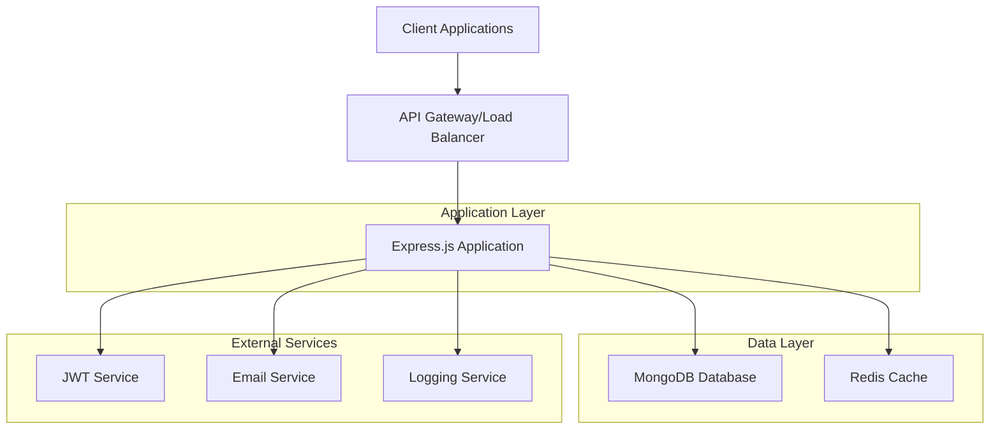
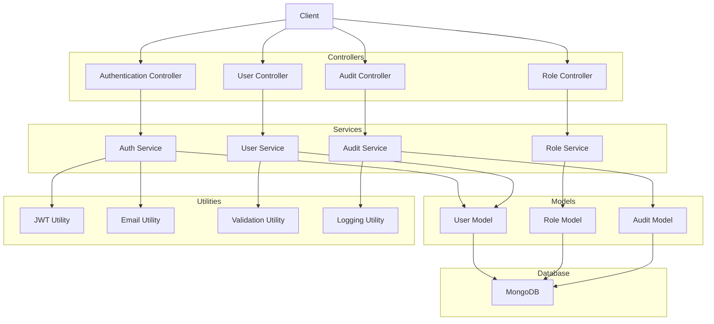
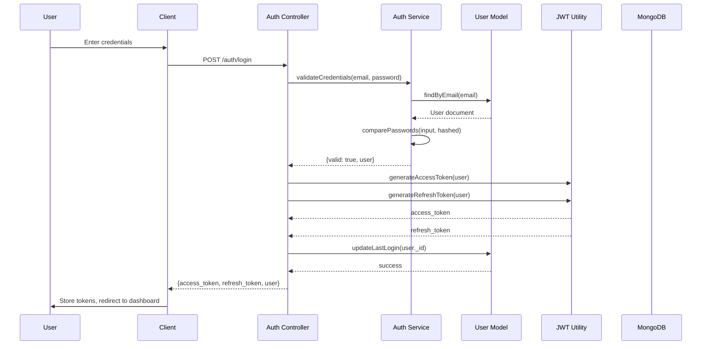
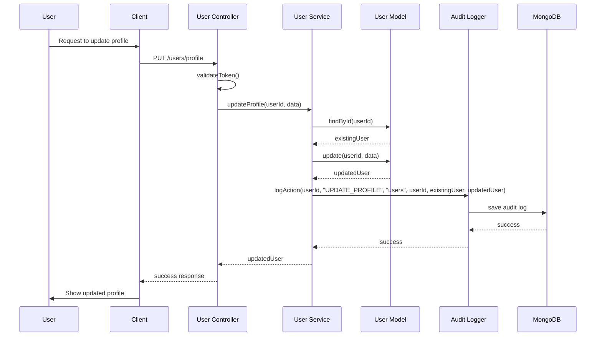
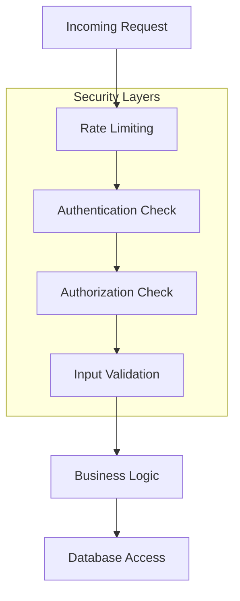

# System Architecture

## Overview
This document provides a visual representation of the user management system architecture using Mermaid diagrams.

## High-Level Architecture



## Component Diagram



## Authentication Flow



## Data Flow for User Management



## Security Layers



## Audit Logging Flow

```mermaid
graph TD
    A[User Action] --> B[Controller]
    B --> C[Service Layer]
    C --> D[Model Operation]
    D --> E[Database]
    C --> F[Audit Logger]
    F --> G[Audit Collection]
    
    subgraph "Audit Trail"
        F
        G
    end